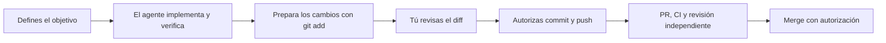

<div align="center">

# Agent Scaffolding

### Tus agentes trabajan. Tú revisas antes de publicar.

Un contrato común para trabajar con **Codex, Claude y Gemini**, mantener el contexto de tus proyectos y delegar cuando aporta valor.

[](https://github.com/theBrokenCat/agent-scaffolding/actions/workflows/ci.yml)

[Cómo funciona](#cómo-funciona) · [Empezar](#empezar) · [Documentación](#documentación)

</div>

---

## ¿Qué te aporta?

| | En tu día a día |
| --- | --- |
| **👀 Revisión antes de publicar** | El agente prepara los cambios con `git add`. Puedes revisar el diff antes de autorizar commit y push. |
| **🧭 Contexto para retomar** | El lead conserva el estado del objetivo, los bloqueos, las pruebas y los siguientes pasos. |
| **📚 Documentación al día** | Las instrucciones locales y el contexto en Outline se actualizan cuando hay novedades importantes. |
| **🤝 Delegación con límites** | Cuatro roles genéricos, tareas acotadas y un lead responsable de integrar y verificar. |
| **🏠 Una fuente común** | Se instala globalmente. Cada proyecto añade solo sus comandos, convenciones y restricciones. |

El scaffolding es un conjunto de instrucciones, definiciones de agentes y herramientas de instalación. **No es un servicio que ejecute proyectos por sí solo ni un bloqueo técnico de Git.** Su cumplimiento depende de que el host cargue y siga el contrato.

## Cómo funciona



### El código pasa por tus manos

El agente ejecuta `git add` **solo sobre sus cambios** y te indica qué archivos modificó y qué comprobó. Los cambios quedan preparados —*staged*— para que puedas ver las diferencias en Codex o con `git diff --cached`, desde el checkout donde trabajó.

**No hace commit ni push hasta que se lo indiques tras revisar el diff.** Si el contenido cambia después de tu aprobación, vuelve a presentarlo. Puedes autorizar expresamente otro flujo para una tarea concreta; el merge conserva su autorización separada.

### El contexto también forma parte del trabajo

El lead mantiene las instrucciones locales cuando cambian hechos duraderos, como los comandos de pruebas o las restricciones del proyecto. Para objetivos de varias sesiones, conserva un registro que permita continuar sin reconstruir toda la conversación.

En **Outline**, actualiza el documento existente del proyecto ante avances importantes, bloqueos, decisiones y cambios de arranque o pruebas. Conserva tus ediciones y enlaza el detalle del repositorio. Requiere acceso MCP y escritura habilitada; si no puede actualizarlo, lo deja explícitamente pendiente. [Ver la política de Outline →](policies/README.md#mantenimiento-de-outline)

### Cuatro roles, según lo que haga falta

| Rol | Para qué sirve |
| --- | --- |
| `explorer` | Entender el código y localizar evidencia. |
| `implementer` | Implementar un cambio acotado y comprobarlo. |
| `spec-reviewer` | Revisar si el objetivo y su aceptación están bien definidos. |
| `quality-reviewer` | Revisar el resultado y detectar problemas antes de integrar. |

**No hay que lanzar los cuatro en cada tarea.** La ejecución directa es el punto de partida. El lead conserva las decisiones, la integración y la verificación; los subagentes no delegan a su vez. [Cómo se eligen y coordinan →](agents/README.md)

## Empezar

### 1. Instala las instrucciones globales

Necesitas Git y un entorno compatible con los scripts de shell del repositorio. Trabaja desde el checkout canónico de `main`, no desde un worktree temporal.

```sh
git clone https://github.com/theBrokenCat/agent-scaffolding.git ~/agent-scaffolding
cd ~/agent-scaffolding

# Primero, inspecciona el plan.
scripts/scaffolding install

# Después, aplica y comprueba la instalación.
scripts/scaffolding install --apply
scripts/scaffolding status
scripts/scaffolding doctor
```

Si ya tienes el repositorio, usa ese checkout. Si existen instrucciones globales previas, el instalador se detiene: revisa el plan de `install --migrate-existing` y usa `--apply` solo si quieres respaldarlas y sustituirlas.

<details>
<summary><strong>Destinos, copias de seguridad y desinstalación</strong></summary>

```text
~/.codex/AGENTS.md   → ~/agent-scaffolding/AGENTS.md
~/.claude/CLAUDE.md → ~/agent-scaffolding/CLAUDE.md
~/.gemini/GEMINI.md → ~/agent-scaffolding/GEMINI.md
```

El manifiesto y los backups quedan fuera del repositorio, en `~/.local/state/agent-scaffolding/`. Las operaciones de instalación y desinstalación muestran un plan salvo que añadas `--apply`.

```sh
scripts/scaffolding uninstall         # Ver el plan
scripts/scaffolding uninstall --apply # Restaurar el estado anterior
```

`status` y `doctor` también funcionan desde worktrees registrados del mismo repositorio: identifican el checkout canónico y lo indican con `NOTE`. Las operaciones que instalan o retiran archivos siguen exigiendo el checkout canónico.

</details>

### 2. Añade subagentes si los necesitas

La instalación de instrucciones y la de subagentes son independientes. Antes de generar agentes, configura los identificadores reales de tus modelos en `~/.config/agent-scaffolding/model-map.yaml`, siguiendo el [ejemplo comentado](settings/schemas/model-map.example.yaml). Sus nombres de ejemplo no son identificadores instalables.

```sh
# Ejemplo para Codex. Para Claude, cambia codex por claude.
scripts/gen-agents --host codex --role explorer-economy
scripts/scaffolding install --agents --host codex
scripts/scaffolding install --agents --host codex --apply
scripts/scaffolding doctor --agents --host codex
```

El generador produce definiciones para **Codex y Claude**. Gemini tiene adaptador de instrucciones, pero no una unidad de subagentes en este repositorio.

<details>
<summary><strong>Estados, modelos y cambios en la instalación</strong></summary>

Cada combinación de rol y estado tiene su propio archivo en `~/.codex/agents/` o `~/.claude/agents/`. Un estado selecciona capacidad y esfuerzo; no es otra especialidad ni concede más permisos. Las definiciones incluyen su ficha y el contrato común de retorno: terminar una revisión no equivale a aprobarla.

La selección se hace mediante el nombre del agente definido. El [protocolo de despacho](agents/README.md#orquestacion) explica los estados, la escalada y cómo comprobar el modelo realmente utilizado.

```sh
scripts/scaffolding status --agents --host codex
scripts/scaffolding uninstall --agents --host codex --apply
```

Los archivos de agentes son contenido generado, no enlaces. El estado distingue cambios en el destino de cambios en el render. Cada host conserva su manifiesto y restauración independientes. Añadir o quitar un rol canónico invalida una unidad instalada y requiere recuperación explícita; no hay migración automática de ese conjunto.

</details>

### 3. Comprueba que tu host lo carga

Un enlace o un archivo instalado no demuestran que el host haya cargado las instrucciones o ejecutado el modelo esperado. Sigue la [comprobación de runtime](tests/runtime-parity.md) en tu entorno.

Después, trabaja en tus proyectos habituales: **no copies el scaffolding en cada repositorio**. Añade instrucciones locales únicamente cuando aporten contexto propio. [Guía para proyectos →](templates/README.md)

## Comprobaciones y alcance

La [CI de las pull requests](.github/workflows/ci.yml) ejecuta ocho suites. La revisión independiente sigue siendo necesaria para integrar; un check llamado `reviewer-disabled` no la acredita.

<details>
<summary><strong>Ejecutar las ocho suites localmente</strong></summary>

Requieren shell y Python 3.11 o posterior. No necesitan llamadas a modelos ni credenciales reales.

```sh
sh tests/contract_test.sh
sh tests/scaffolding_test.sh
sh tests/registry_test.sh
sh tests/gen_agents_test.sh
sh tests/ci_reviewer_test.sh
sh tests/orchestration_test.sh
sh tests/pilot_run_test.sh
sh tests/protect_repo_test.sh
```

Para configurar checks, protección de ramas y el revisor automático, consulta la [guía de GitHub](.github/WORKFLOW.md).

</details>

El mapeo de modelos es provisional. Las pruebas del repositorio y los [pilotos históricos](docs/pilots/2026-09-02-phase-2-model-routing.md) no demuestran rendimiento máximo ni ahorro general: esas conclusiones requieren comparaciones sobre trabajo real. Los pendientes están en [el registro del proyecto](tasks/todo.md).

## Documentación

| Quiero… | Dónde encontrarlo |
| --- | --- |
| Entender permisos y flujo de trabajo | [Contrato global](AGENTS.md) |
| Elegir ejecución directa o delegación | [Router](ROUTER.md) |
| Preparar y coordinar subagentes | [Guía de agentes](agents/README.md) · [Fichas de roles](agents/roles/) |
| Consultar límites y mantenimiento de Outline | [Políticas operativas](policies/README.md) |
| Ver las diferencias entre hosts | [Claude](CLAUDE.md) · [Gemini](GEMINI.md) |
| Preparar un proyecto nuevo | [Plantillas opcionales](templates/README.md) |
| Consultar los antiguos perfiles | [Índice de compatibilidad](profiles/README.md) |
